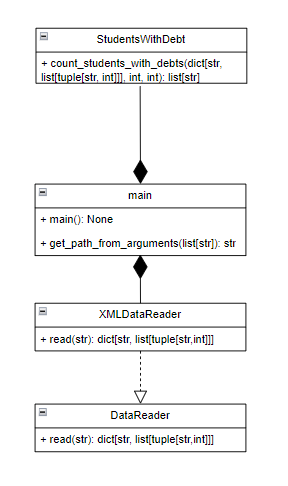

# Лабораторная 1 по дисциплине "Технологии программирования"

## Вариант 10

**Формат входного файла**: XML

**Расчетная процедура**: 
Рассчитать и вывести на экран количество студентов,
имеющих академические задолженности (имеющих балл
< 61) ровно по двум предметам.

## Используемые технологии:
**Язык программирования:** Python

**Тесты:** Pytest

**Линтер:** Pycodestyle

## Диаграмма классов:

